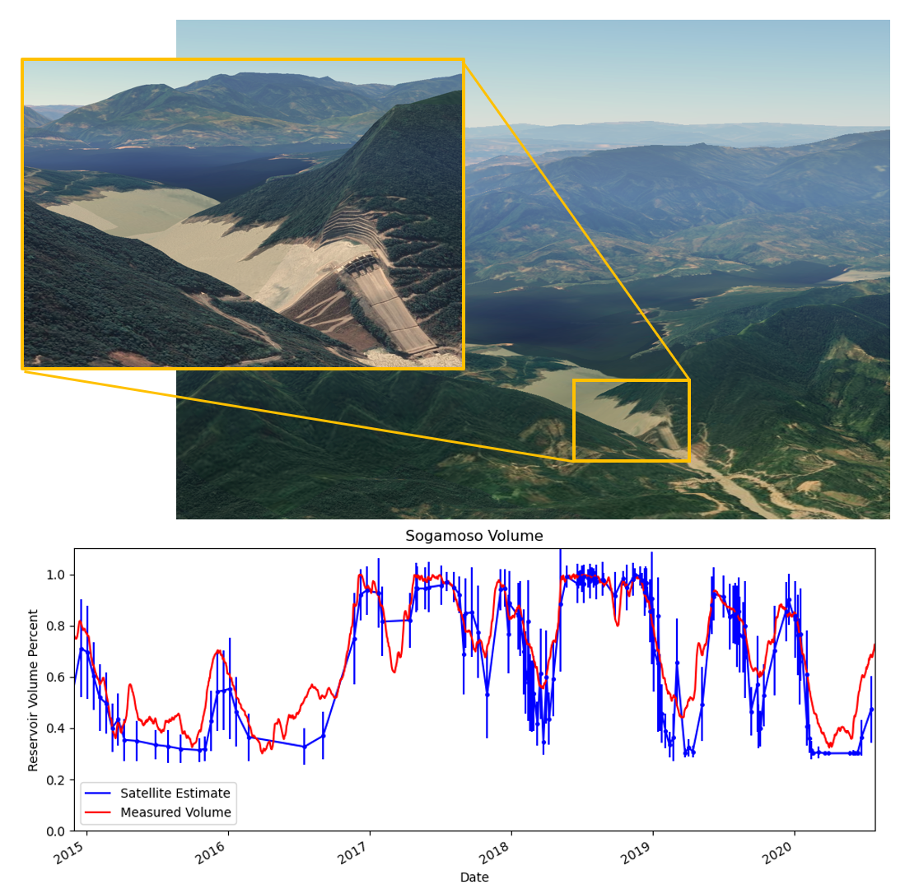

I leveraged Sentinel-2 and Landsat-8 data to estimate the volume of water in remote reservoirs. By developing a custom computer vision algorithm, I was able to monitor changes in water levels over time, thereby informing emergency response efforts and shaping healthcare policy in vulnerable communities.

### Methodology

* Collect, reproject, and crop, imagery from Sentinel-2 and Landsat-8
* Use NDWI to identify the body of water
* monitor the shoreline of the reservoir, observing when the volume increases or decreases.
* detect cloudcover and only monitor the parts of the shoreline that are visible. 