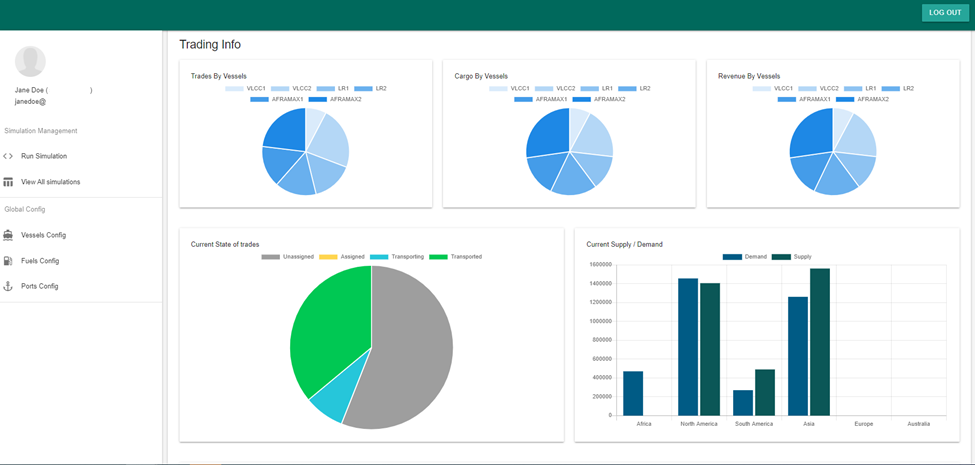

In this project, we tracked the journeys of many of the world's oil tankers, and analyzed international trade routes.
The available GPS & AIS data available needed cleaning and processing to identify individual trade routes and to estimate vessel cargo tonnage.
The work aimed to understand current trade dynamics and predict the impact of future carbon tax policies on global trade,
and to suggest fleet upgrades to reduce the impact of the carbon tax.
A dashboard was created to allow the users to customize and run simulations of future carbon policy scenarios, helping them understand how best to adapt their fleet.

### Methodology

* Collect publicly available AIS data for each known oil tanker.
* Clean the vessels' GPS traces, which often contain missing or erroneous data. 
* Infer the cargo tonnage of each vessel from the draft height (how low in the water the vessel is floating)  
* Categories the GPS traces into individual trades, including the start and end port, and the tonnage of product shipped.
* Create a monte carlo simulation of international trade that is modelled after the observed international trade behaviour.